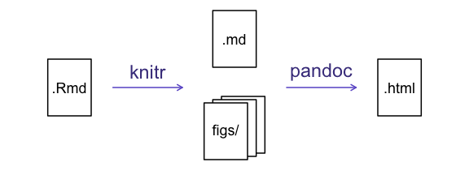

```{r, echo=FALSE, purl=FALSE, message = FALSE}
source("setup.R")
opts_chunk$set(tidy = FALSE, results = "markup", comment = NA)
surveys_complete <- read_csv(file = "data_raw/portal_data_joined.csv", col_types = cols()) %>%
  drop_na(weight, hindfoot_length, sex) %>%
  group_by(species_id) %>%
  filter(n() >= 50) %>%
  ungroup()
```

------------

> ### Learning Objectives
>
> * Create a .Rmd document containing R code, text, and plots
> * Create a YAML header to control output
> * Understand basic syntax of (R)Markdown
> * Customise code chunks to control formatting
> * Use code chunks and in-line code to create dynamic, reproducible documents

------------

## R Markdown

R Markdown is a flexible type of document that allows you to seamlessly combine 
executable R code, and its output, with text in a single document. These
documents can be readily converted to multiple static and dynamic output
formats, including PDF (.pdf), Word (.docx), and HTML (.html).

The benefit of a well-prepared R Markdown document is full reproducibility. This
also means that, if you notice a data transcription error, or you are able to
add more data to your analysis, you will be able to recompile the report without
making any changes in the actual document.

The **rmarkdown** package comes pre-installed with RStudio, so no action is 
necessary.

<figure>
```{r rmarkdown-wizards, echo = FALSE, fig.show = "hold", fig.alt = "R Markdown wizard monsters creating a R Markdown document from a recipe. Art by Allison Horst", out.width="100%"}
knitr::include_graphics("./img/rmarkdown_wizards.png")
```
<figcaption>
Image credit: <a href="https://github.com/allisonhorst/stats-illustrations">Allison Horst</a>
</figcaption>
</figure>


### Creating an R Markdown file

To create a new R Markdown document in RStudio, click File -> New File -> 
R Markdown:


Then click on 'Create Empty Document'. Normally you could enter the title of
your document, your name (Author), and select the type of output, but we will be
learning how to start from a blank document.

### Basic components of R Markdown

To control the output, a YAML (YAML Ain't Markup Language) header is needed:

```
---
title: "My Awesome Report"
author: "Emmet Brickowski"
date: ""
output: html_document
---
```

The header is defined by the three hyphens at the beginning (`---`) and the
three hyphens at the end (`---`). 

In the YAML, the only required field is the `output:`, which specifies the type
of output you want. This can be an `html_document`, a `pdf_document`, or a 
`word_document`. We will start with an HTML doument and discuss the other
options later. 

The rest of the fields can be deleted, if you don't need them. After the header,
to begin the body of the document, you start typing after the end of the YAML
header (i.e. after the second `---`).

### Markdown syntax

Markdown is a popular markup language that allows you to add formatting elements
to text, such as **bold**, *italics*, and `code`. The formatting will not be
immediately visible in a markdown (.md) document, like you would see in a Word
document. Rather, you add Markdown syntax to the text, which can then be
converted to various other files that can translate the Markdown syntax.
Markdown is useful because it is lightweight, flexible, and platform
independent.

Some platforms provide a real time preview of the formatting, like RStudio's 
visual markdown editor (available from version 1.4).

First, let's create a heading! A `#` in front of text indicates to Markdown that 
this text is a heading. Adding more `#`s make the heading smaller, i.e. one `#` is 
a first level heading, two `##`s is a second level heading, etc. upto the 6th level heading.

```
# Title
## Section
### Sub-section
#### Sub-sub section
##### Sub-sub-sub section
###### Sub-sub-sub-sub section
```
(only use a level if the one above is also in use)

Since we have already defined our title in the YAML header, we will use a 
section heading to create an Introduction section.

```
## Introduction
```

You can make things **bold** by surrounding the word with double asterisks, 
`**bold**`, or double underscores, `__bold__`; and *italicize* using single
asterisks, `*italics*`, or single underscores, `_italics_`.

You can also combine **bold** and *italics* to write something ***really*** 
important with triple-asterisks, `***really***`, or underscores, `___really___`;
and, if you're feeling bold (pun intended), you can also use a combination of
asterisks and underscores, `**_really_**`, `**_really_**`. 

To create `code-type` font, surround the word with backticks, 
&#96;code-type&#96;.

Now that we've learned a couple of things, it might be useful to implement them:

```
## Introduction

This report uses the **tidyverse** package along with the *Portal Project Teaching Database*, 
which has columns that include:
```
Then we can create a list for the variables using `-`, `+`, or `*` keys.

```
## Introduction

This report uses the **tidyverse** package along with the *SAFI* dataset, 
which has columns that include:

- record_id
- year
- plot_id
- species_id
- sex
- hindfoot_length
- weight
- genus
- plot_type
```

You can also create an ordered list using numbers:

```
1. record_id
2. year
3. plot_id
4. species_id
5. sex
6. hindfoot_length
7. weight
8. genus
9. plot_type
```

And nested items by tab-indenting:

```
- record_id
  + Unique identifier of this observation
- year
  + Date of observation
- plot_id
  + Plot where observation was made
- sex
  + The sex of the observed animal
```

For more Markdown syntax see [the following reference guide](https://www.markdownguide.org/basic-syntax).

Now we can render the document into HTML by clicking the **Knit** button in the
top of the Source pane (top left), or use the keyboard shortcut
<kbd>Ctrl</kbd>+<kbd>Shift</kbd>+<kbd>K</kbd> on Windows and Linux, and 
<kbd>Cmd</kbd>+<kbd>Shift</kbd>+<kbd>K</kbd> on Mac. If you haven't saved the
document yet, you will be prompted to do so when you **Knit** for the first
time.




## Writing an R Markdown report

Now we will add some R code from our previous data wrangling and visualisation,
which means we need to make sure **tidyverse** is loaded. It is not enough to
load **tidyverse** from the console, we will need to load it within our R Markdown
document. The same applies to our data. To load these, we will need to create a 
'code chunk' at the top of our document (below the YAML header). 

A code chunk can be inserted by clicking Code > Insert Chunk, or by using the
keyboard shortcuts <kbd>Ctrl</kbd>+<kbd>Alt</kbd>+<kbd>I</kbd> on Windows and Linux,
and <kbd>Cmd</kbd>+<kbd>Option</kbd>+<kbd>I</kbd> on Mac.

The syntax of a code chunk is:

<pre>
&#96;&#96;&#96;{r chunk-name}
Here is where you place the R code that you want to run.
&#96;&#96;&#96;
</pre>

An R Markdown document knows that this text is not part of the report from the 
` ``` ` that begins and ends the chunk. It also knows that the code
inside of the chunk is R code from the `r` inside of the curly braces (`{}`). 
After the `r` you can add a name for the code chunk . Naming a chunk is
optional, but recommended. Each chunk name must be unique, and only contain
alphanumeric characters and `-`.

To load **tidyverse** and our `surveys_complete.csv` file, we will insert a chunk and 
call it 'setup'. Since we don't want this code or the output to show in our
knitted HTML document, we add an `include = FALSE` option after the code chunk 
name (`{r setup, include = FALSE}`). 

<pre>
&#96;&#96;&#96;{r setup, include = FALSE}
library(tidyverse)
library(here)
surveys_complete <- read_csv(here("data/surveys_complete.csv"))
&#96;&#96;&#96;
</pre>

If you were unable to complete the previous lesson or did not save the data,
then you can create it in a new code chunk instead.

<pre>
&#96;&#96;&#96;{r surveys-data, include = FALSE}
surveys_complete <- read_csv(here("data_raw/portal_data_joined.csv")) |>
  drop_na(weight, hindfoot_length, sex) |>
  group_by(species_id) |>
  filter(n() >= 50) |>
  ungroup()
&#96;&#96;&#96;
</pre>

> ### Important Note!
>
> The file paths you give in a .Rmd document, e.g. to load a .csv file, are 
> relative to the .Rmd document, **not** the project root. 
>
> We highly recommend the use of the `here()` function to keep the file paths consistent within your project.

## Insert table

Next, we will re-create a table from the Manipulating Data episode which 
shows average animal weight grouped by `species_id` and `sex`. 
We can do this by creating a new code chunk and calling it 'weight-tbl'. 
Or, you can come up with something more creative (just remember to stick to the
naming rules).

It isn't necessary to **Knit** your document every time you want to see the
output. Instead you can run the code chunk with the green triangle in the top
right corner of the the chunk, or with the keyboard shortcuts: 
<kbd>Ctrl</kbd>+<kbd>Alt</kbd>+<kbd>C</kbd> on Windows and Linux, or
<kbd>Cmd</kbd>+<kbd>Option</kbd>+<kbd>C</kbd> on Mac.

To make sure the table is formatted nicely in our output document, we will need
to use the `kable()` function from the **knitr** package. The `kable()` function 
takes the output of your R code and knits it into a nice looking HTML table. You
can also specify different aspects of the table, e.g. the column names, a
caption, etc. 

Run the code chunk to make sure you get the desired output.

<pre>
&#96;&#96;&#96;{r weight-tbl, message=FALSE}
surveys_complete |>
  group_by(species_id, sex) |>
  summarize(mean_weight = mean(weight, na.rm = TRUE)) |>
  head(n=10) |>
  knitr::kable(caption = "We can also add a caption.",
               col.names = c("Species", "Sex", "Mean Weight"))
&#96;&#96;&#96;
</pre>

```{r weight-tbl, message=FALSE, purl=FALSE, echo=FALSE}
surveys_complete |>
  group_by(species_id, sex) |>
  summarize(mean_weight = mean(weight, na.rm = TRUE)) |>
  head(n=10) |>
  knitr::kable(caption = "We can also add a caption.",
               col.names = c("Species", "Sex", "Mean Weight"))
```

## Customizing chunk output

We mentioned using `include = FALSE` in a code chunk to prevent the code and 
output from printing in the knitted document. There are additional options
available to customize how the code-chunks are presented in the output document.
The options are entered in the code chunk after `chunk-name`and separated by
commas, e.g. `{r chunk-name, eval = FALSE, echo = TRUE}`.

| Option | Options | Output |
|--------|---------|--------|
| `eval` | `TRUE` or `FALSE` | Whether or not the code within the code chunk should be run. |
| `echo` | `TRUE` or `FALSE` | Choose if you want to show your code chunk in the output document. `echo = TRUE` will show the code chunk. |
| `include` | `TRUE` or `FALSE` | Choose if the output of a code chunk should be included in the document. `FALSE` means that your code will run, but will not show up in the document. |
| `warning` | `TRUE` or `FALSE` | Whether or not you want your output document to display potential warning messages produced by your code. |
| `message` | `TRUE` or `FALSE` | Whether or not you want your output document to display potential messages produced by your code. |
| `fig.align` | `default`, `left`, `right`, `center` | Where the figure from your R code chunk should be output on the page


> ### Tip
>
> - The default settings for the above chunk options are all `TRUE`.
> - The default settings can be modified per chunk, or with 
> `knitr::opts_chunk$set()`,
> - Entering `knitr::opts_chunk$set(echo = FALSE)` will change the default of
> value of `echo` to `FALSE` for **every** code chunk in the document.

> ### Challenge {.challenge}
>
> Play around with the different options in the chunk with the code for the 
> table, and re-**Knit** to see what each option does to the output.
>
> What happens if you use `eval = FALSE` and `echo = FALSE`? What is the
> difference between this and `include = FALSE`? 
> ```{text_answer, echo=FALSE, purl=FALSE}
> Create a chunk with `{r eval = FALSE, echo = FALSE}`, then create another
> chunk with `{r include = FALSE}` to compare.
> `eval = FALSE` and `echo = FALSE` will neither run the code in the chunk,
> nor show the code in the knitted document. The code chunk essentially
> doesn't exist in the knitted document as it was never run. Whereas
> `include = FALSE` will run the code and store the output for later use.
> ```
> 

## In-line R code

Now we will use some in-line R code to present some descriptive statistics.
To use in-line R-code, we use the same backticks that we used in the Markdown
section, with an `r` to specify that we are generating R-code. The difference 
between in-line code and a code chunk is the number of backticks. In-line R code 
uses one backtick (``` `r` ```), whereas code chunks use three backticks 
(&#96;&#96;&#96; r &#96;&#96;&#96;). 

For example, today's date is &#96;r Sys.Date()&#96;, will be rendered as: 
today's date is `r Sys.Date()`.  
The code will display today's date in the output document (well, technically the 
date the document was last knitted).

The best way to use in-line R code, is to minimise the amount of code you need
to produce the in-line output by preparing the output in code chunks. Let's say
we're interested in presenting the average hindfoot length of a genus. 

<pre>
&#96;&#96;&#96;{r in-line-code}
# create a summary data frame with the mean hindfoot length by genus
mean_hindfoot <- surveys_complete |>
  group_by(genus) |>
  summarize(mean_hindfoot_length = mean(hindfoot_length))

# and select the genus we want to use
mean_neotoma <- mean_hindfoot %>%
  filter(genus == "Neotoma")
&#96;&#96;&#96;
</pre>

```{r in-line-code, purl=FALSE, echo=FALSE}
# create a summary data frame with the mean hindfoot length by village
mean_hindfoot <- surveys_complete |>
  group_by(genus) |>
  summarize(mean_hindfoot_length = mean(hindfoot_length))

# and select the genus we want to use
mean_neotoma <- mean_hindfoot %>%
  filter(genus == "Neotoma")
```

Now we can make an informative statement on the means of each village, and include
the mean values as in-line R-code. For example: 

The average hindfoot length in the genus *Neotoma* is 
&#96;r round(mean_neotoma$mean_hindfoot_length, 2)&#96;

becomes ...

The average hindfoot length in the genus *Neotoma* is 
`r round(mean_neotoma$mean_hindfoot_length, 2)`.

Because we are using in-line R code instead of the actual values, we have created
a dynamic document that will automatically update if we make changes to the dataset
and/or code chunks.

## Plots

Finally, we will also include a plot, so our document is a little more colorful 
and a little less boring.

<pre>
&#96;&#96;&#96;{r surveys-plot}
yearly_counts <- surveys_complete |>
  count(year, genus)
ggplot(data = yearly_counts, aes(x = year, y = n, color = genus)) +
    geom_line()
&#96;&#96;&#96;
</pre>

```{r surveys-plot, echo=FALSE, purl=FALSE}
yearly_counts <- surveys_complete |>
  count(year, genus)
ggplot(data = yearly_counts, aes(x = year, y = n, color = genus)) +
    geom_line()
```

> ### Challenge {.challenge}
>
> Add a second plot to your document that shows the yearly counts of animals per genera separated by sex
> and using a facet to create sub plots per genus.
>
> > ```{text_answer, echo=FALSE, purl=FALSE}
> > <pre>
> > &#96;&#96;&#96;{r my-fancy-plot}
> >  yearly_sex_counts <- surveys_complete |>
> >    count(year, genus, sex)
> >  ggplot(data = yearly_sex_counts, mapping = aes(x = year, y = n, color = sex)) +
> >    geom_line() +
> >    facet_wrap(facets =  vars(genus))
> > &#96;&#96;&#96;
> > </pre>
> > ```

We can also create a caption with the chunk option `fig.cap`.

<pre>
&#96;&#96;&#96;{r chunk-name, fig.cap = "I made this plot while attending an
awesome Data Carpentries workshop where I learned a ton of cool stuff!"}
# Code for plot
&#96;&#96;&#96;
</pre>

or, ideally, something more informative.

```{r surveys-plot2, echo=FALSE, purl=FALSE, fig.cap = "I made this plot while attending an awesome Data Carpentries workshop where I learned a ton of cool stuff!"}
yearly_counts <- surveys_complete |>
  count(year, genus)
ggplot(data = yearly_counts, aes(x = year, y = n, color = genus)) +
    geom_line()
```

## Other output options

You can convert R Markdown to a PDF or a Word document (among others). 
Click the little triangle next to the **Knit** button to get a drop-down menu. 
Or you could put `pdf_document` or `word_document` in the initial header of the file.

```
---
title: "My Awesome Report"
author: "Emmet Brickowski"
date: ""
output: word_document
---
```

> ### Note: Creating PDF documents {.callout}
>
> Creating .pdf documents may require installation of some extra software. The R 
> package `tinytex` provides some tools to help make this process easier for R users.
> With `tinytex` installed, run `tinytex::install_tinytex()` to install the required
> software (you'll only need to do this once) and then when you **Knit** to pdf `tinytex`
> will automatically detect and install any additional LaTeX packages that are needed to 
> produce the pdf document. Visit the [tinytex website](https://yihui.org/tinytex/) 
> for more information.
>


## Resources

* [Knitr in a knutshell tutorial](http://kbroman.org/knitr_knutshell)
* [Dynamic Documents with R and knitr](http://www.amazon.com/exec/obidos/ASIN/1482203537/7210-20) (book)
* [R Markdown documentation](http://rmarkdown.rstudio.com)
* [R Markdown cheat sheet](https://github.com/rstudio/cheatsheets/blob/master/rmarkdown-2.0.pdf)
* [Getting started with R Markdown](https://www.rstudio.com/resources/webinars/getting-started-with-r-markdown/)
* [Markdown tutorial](https://commonmark.org/help/tutorial/)
* [R Markdown: The Definitive Guide](https://bookdown.org/yihui/rmarkdown/) (book by Rstudio team)
* [Reproducible Reporting](https://www.rstudio.com/resources/webinars/reproducible-reporting/)
* [The Ecosystem of R Markdown](https://www.rstudio.com/resources/webinars/the-ecosystem-of-r-markdown/)
* [Introducing Bookdown](https://www.rstudio.com/resources/webinars/introducing-bookdown/)
